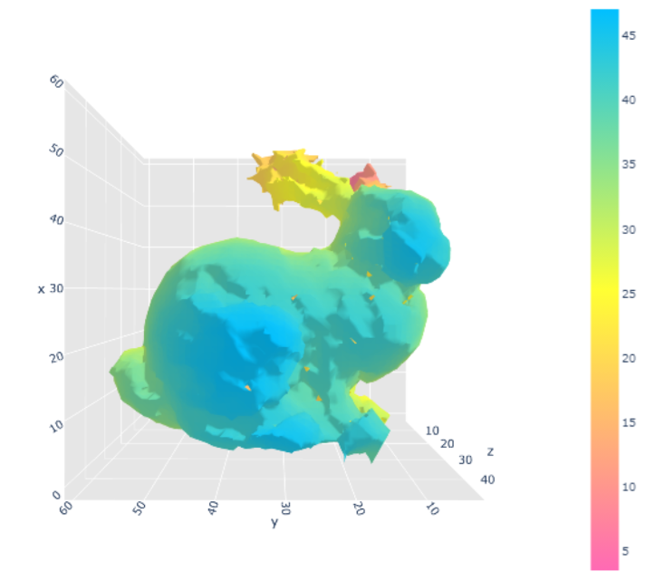
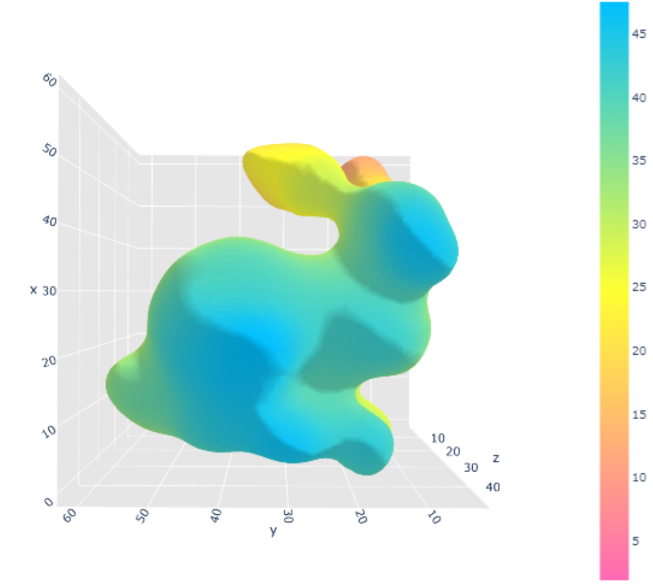
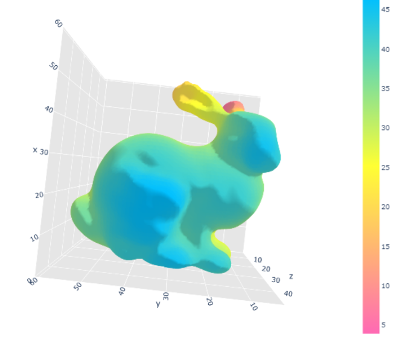

# Surface-Reconstruction using Deep Learning algorithms from Point Clouds

Reconstruction of Surface of a Sphere and a Bunny from point clouds using Naive, MLS and RBF Reconstruction

We use point clouds having 500 points and 1000 points.
In general results from point clouds with 1000 points yield better results.

The results for the Reconstruction look like these for bunny with 500 points in point cloud:

### Naive Reconstruction method
 

### MLF Reconstruction method for Smooth surfaces
 

### Rbf Reconstruction method for Detailed features
 

### Deep Rbf Reconstruction method
 
